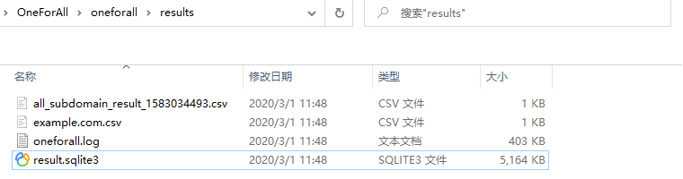
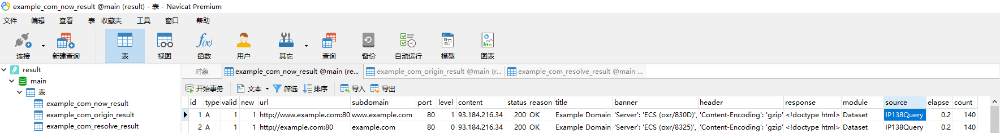

# OneForAll

[](https://travis-ci.org/shmilylty/OneForAll)
[](https://codecov.io/gh/shmilylty/OneForAll)
[](https://codeclimate.com/github/shmilylty/OneForAll/maintainability)
[](https://github.com/shmilylty/OneForAll/tree/master/LICENSE)
[](https://github.com/shmilylty/OneForAll/tree/master/)
[](https://github.com/shmilylty/OneForAll/releases)

👊**OneForAll是一款功能强大的子域收集工具**  📝[English Document](https://github.com/shmilylty/OneForAll/tree/master/docs/en-us/README.md)


## 🚀上手指南

📢 请务必花一点时间阅读此文档，有助于你快速熟悉OneForAll！

<details>
<summary><b>🐍安装要求</b></summary>

OneForAll基于[Python 3.6.0]( https://www.python.org/downloads/release/python-360/ )开发和测试，OneForAll需要高于Python 3.6.0的版本才能运行。
安装Python环境可以参考[Python 3 安装指南](https://pythonguidecn.readthedocs.io/zh/latest/starting/installation.html#python-3)。运行以下命令检查Python和pip3版本：
```bash
python -V
pip3 -V
```
如果你看到类似以下的输出便说明Python环境没有问题：
```bash
Python 3.6.0
pip 19.2.2 from C:\Users\shmilylty\AppData\Roaming\Python\Python36\site-packages\pip (python 3.6)
```
</details>

<details>
<summary><b>✔安装步骤（git 版）</b></summary>

1. **下载**

由于该项目**处于开发中**，会不断进行更新迭代，下载时请使用`git clone`**克隆**最新代码仓库，也方便后续的更新，不推荐从Releases下载，因为Releases里版本更新缓慢，也不方便更新，
本项目已经在[码云](https://gitee.com/shmilylty/OneForAll.git)(Gitee)镜像了一份，国内推荐使用码云进行克隆比较快：

```bash
git clone https://gitee.com/shmilylty/OneForAll.git
```
或者：
```bash
git clone https://github.com/shmilylty/OneForAll.git
```

2. **安装**

你可以通过pip3安装OneForAll的依赖，以下为**Windows系统**下使用**pip3**安装依赖的示例：注意：如果你的Python3安装在系统Program Files目录下，如：`C:\Program Files\Python36`，那么请以管理员身份运行命令提示符cmd执行以下命令！

```bash
cd OneForAll/
python3 -m pip install -U pip setuptools wheel -i https://mirrors.aliyun.com/pypi/simple/
pip3 install -r requirements.txt -i https://mirrors.aliyun.com/pypi/simple/
python3 oneforall.py --help
```

其他系统平台的请参考[依赖安装](https://github.com/shmilylty/OneForAll/tree/master/docs/installation_dependency.md)，如果在安装依赖过程中发现编译某个依赖库失败时可以参考[常见问题与回答.md](https://github.com/shmilylty/OneForAll/tree/master/docs/troubleshooting.md)文档中解决方法，如果依然不能解决欢迎加群反馈问题。

3. **更新**

执行以下命令**更新**项目（可保存对`/config/setting.py`和`/config/api.py`的修改）：

```bash
git stash        # 暂存本地的修改
git fetch --all  # 拉取项目更新
git pull         # 下载覆盖
git stash pop    # 释放本地修改
```
</details>

<details>
<summary><b>✔安装步骤（docker 版）</b></summary>

首先下载并编辑配置文件，添加自己的`api`和个性化设置，并保留原始文件结构

```
config
├── api.py
├── log.py
└── setting.py
```

拉取镜像并执行，其中`~/.config`替换为你自己配置文件所在文件夹的路径

```shell
docker pull shmilylty/oneforall
docker run -it --rm -v ~/results:/OneForAll/results -v ~/.config:/OneForAll/config oneforall --target example.com run
```
参数直接加在指令末尾，结果会输出在本地目录`~/results`，如需保存到其他位置，可以自行修改
</details>


<details>
<summary><b>✨使用演示</b></summary>

如果你是通过pip3安装的依赖则使用以下命令运行示例：   
```bash
python3 oneforall.py --target example.com run
python3 oneforall.py --targets ./example.txt run
```


</details>

<details>
<summary><b>🧐结果说明</b></summary>

我们以`python3 oneforall.py --target example.com run`命令为例，OneForAll在默认参数正常执行完毕会在results目录生成相应结果：



`example.com.csv`是每个主域下的子域收集结果。

`all_subdomain_result_1583034493.csv`是每次运行OneForAll收集到子域的汇总结果，包含`example.com.csv`，方便在批量收集场景中获取全部结果。

`result.sqlite3`是存放每次运行OneForAll收集到子域的SQLite3结果数据库，其数据库结构如下图：



其中类似`example_com_origin_result`表存放每个模块最初子域收集结果。

其中类似`example_com_resolve_result`表存放对子域进行解析后的结果。

其中类似`example_com_last_result`表存放上一次子域收集结果（需要收集两次以上才会生成）。

其中类似`example_com_now_result`表存放现在子域收集结果，一般情况关注这张表就可以了。

更多信息请参阅[字段解释说明](./docs/field.md)。
</details>

<details>
<summary><b>🤔使用帮助</b></summary>

命令行参数只提供了一些常用参数，更多详细的参数配置请见[setting.py](https://github.com/shmilylty/OneForAll/tree/master/config/setting.py)，如果你认为有些参数是命令界面经常使用到的或缺少了什么参数等问题非常欢迎反馈。由于众所周知的原因，如果要使用一些被墙的收集接口请先到[setting.py](https://github.com/shmilylty/OneForAll/tree/master/config/setting.py)配置代理，有些收集模块需要提供API（大多都是可以注册账号免费获取），如果需要使用请到[api.py](https://github.com/shmilylty/OneForAll/tree/master/config/api.py)配置API信息，如果不使用请忽略有关报错提示。（详细模块请阅读[收集模块说明](https://github.com/shmilylty/OneForAll/tree/master/docs/collection_modules.md)）

OneForAll命令行界面基于[Fire](https://github.com/google/python-fire/)实现，有关Fire更高级使用方法请参阅[使用Fire CLI](https://github.com/google/python-fire/blob/master/docs/using-cli.md)。

[oneforall.py](https://github.com/shmilylty/OneForAll/tree/master/oneforall.py)是主程序入口，oneforall.py可以调用[brute.py](https://github.com/shmilylty/OneForAll/tree/master/brute.py)，[takerover.py](https://github.com/shmilylty/OneForAll/tree/master/takerover.py)及[dbexport.py](https://github.com/shmilylty/OneForAll/tree/master/dbexport.py)等模块，为了方便进行子域爆破独立出了brute.py，为了方便进行子域接管风险检查独立出了takerover.py，为了方便数据库导出独立出了dbexport.py，这些模块都可以单独运行，并且所接受参数要更丰富一点，如果要单独使用这些模块请参考[使用帮助](https://github.com/shmilylty/OneForAll/tree/master/docs/usage_help.md)

❗注意：当你在使用过程中遇到一些问题或者疑惑时，请先到[Issues](https://github.com/shmilylty/OneForAll/issues)里使用搜索找找答案，还可以参阅[常见问题与回答](https://github.com/shmilylty/OneForAll/tree/master/docs/troubleshooting.md)。

**oneforall.py使用帮助**

以下帮助信息可能不是最新的，你可以使用`python oneforall.py --help`获取最新的帮助信息。

```bash
python oneforall.py --help
```
```bash
NAME
    oneforall.py - OneForAll帮助信息

SYNOPSIS
    oneforall.py COMMAND | --target=TARGET <flags>

DESCRIPTION
    OneForAll是一款功能强大的子域收集工具

    Example:
        python3 oneforall.py version
        python3 oneforall.py --target example.com run
        python3 oneforall.py --targets ./domains.txt run
        python3 oneforall.py --target example.com --valid None run
        python3 oneforall.py --target example.com --brute True run
        python3 oneforall.py --target example.com --port small run
        python3 oneforall.py --target example.com --fmt csv run
        python3 oneforall.py --target example.com --dns False run
        python3 oneforall.py --target example.com --req False run
        python3 oneforall.py --target example.com --takeover False run
        python3 oneforall.py --target example.com --show True run

    Note:
        参数alive可选值True，False分别表示导出存活，全部子域结果
        参数port可选值有'default', 'small', 'large', 详见config.py配置
        参数fmt可选格式有 'csv','json'
        参数path默认None使用OneForAll结果目录生成路径

ARGUMENTS
    TARGET
        单个域名(二选一必需参数)
    TARGETS
        每行一个域名的文件路径(二选一必需参数)

FLAGS
    --brute=BRUTE
        s
    --dns=DNS
        DNS解析子域(默认True)
    --req=REQ
        HTTP请求子域(默认True)
    --port=PORT
        请求验证子域的端口范围(默认只探测80端口)
    --valid=VALID
        只导出存活的子域结果(默认False)
    --fmt=FMT
        结果保存格式(默认csv)
    --path=PATH
        结果保存路径(默认None)
    --takeover=TAKEOVER
        检查子域接管(默认False)
```
</details>

## 🎉项目简介

项目地址：[https://github.com/shmilylty/OneForAll](https://github.com/shmilylty/OneForAll)

在渗透测试中信息收集的重要性不言而喻，子域收集是信息收集中必不可少且非常重要的一环，目前网上也开源了许多子域收集的工具，但是总是存在以下部分问题：

* **不够强大**，子域收集的接口不够多，不能做到对批量子域自动收集，没有自动子域解析，验证，FUZZ以及信息拓展等功能。
* **不够友好**，固然命令行模块比较方便，但是当可选的参数很多，要实现的操作复杂，用命令行模式就有点不够友好，如果有交互良好，高可操作的前端那么使用体验就会好很多。
* **缺少维护**，很多工具几年没有更新过一次，issues和PR是啥，不存在的。
* **效率问题**，没有利用多进程，多线程以及异步协程技术，速度较慢。

为了解决以上痛点，此项目应用而生，正如其名，我希望OneForAll是一款集百家之长，功能强大的全面快速子域收集终极神器🔨。

目前OneForAll还在开发中，肯定有不少问题和需要改进的地方，欢迎大佬们提交[Issues](https://github.com/shmilylty/OneForAll/issues)和[PR](https://github.com/shmilylty/OneForAll/pulls)，用着还行给个小星星✨吧，目前有一个专门用于OneForAll交流和反馈QQ群👨‍👨‍👦‍👦：:[**824414244**](//shang.qq.com/wpa/qunwpa?idkey=125d3689b60445cdbb11e4ddff38036b7f6f2abbf4f7957df5dddba81aa90771)（加群验证：信息收集）。

## 👍功能特性

* **收集能力强大**，详细模块请阅读[收集模块说明](https://github.com/shmilylty/OneForAll/tree/master/docs/collection_modules.md)。
  1. 利用证书透明度收集子域（目前有6个模块：`censys_api`，`certspotter`，`crtsh`，`entrust`，`google`，`spyse_api`）
  2. 常规检查收集子域（目前有4个模块：域传送漏洞利用`axfr`，检查跨域策略文件`cdx`，检查HTTPS证书`cert`，检查内容安全策略`csp`，检查robots文件`robots`，检查sitemap文件`sitemap`，利用NSEC记录遍历DNS域`dnssec`，后续会添加NSEC3记录等模块）
  3. 利用网上爬虫档案收集子域（目前有2个模块：`archivecrawl`，`commoncrawl`，此模块还在调试，该模块还有待添加和完善）
  4. 利用DNS数据集收集子域（目前有24个模块：`binaryedge_api`, `bufferover`, `cebaidu`, `chinaz`, `chinaz_api`, `circl_api`, `cloudflare`, `dnsdb_api`, `dnsdumpster`, `hackertarget`, `ip138`, `ipv4info_api`, `netcraft`, `passivedns_api`, `ptrarchive`, `qianxun`, `rapiddns`, `riddler`, `robtex`, `securitytrails_api`, `sitedossier`, `threatcrowd`, `wzpc`, `ximcx`）
  5. 利用DNS查询收集子域（目前有5个模块：通过枚举常见的SRV记录并做查询来收集子域`srv`，以及通过查询域名的DNS记录中的MX,NS,SOA,TXT记录来收集子域）
  6. 利用威胁情报平台数据收集子域（目前有6个模块：`alienvault`, `riskiq_api`，`threatbook_api`，`threatminer`，`virustotal`，`virustotal_api`该模块还有待添加和完善）
  7. 利用搜索引擎发现子域（目前有18个模块：`ask`, `baidu`, `bing`, `bing_api`, `duckduckgo`, `exalead`, `fofa_api`, `gitee`, `github`, `github_api`, `google`, `google_api`, `shodan_api`, `so`, `sogou`, `yahoo`, `yandex`, `zoomeye_api`），在搜索模块中除特殊搜索引擎，通用的搜索引擎都支持自动排除搜索，全量搜索，递归搜索。
* **支持子域爆破**，该模块有常规的字典爆破，也有自定义的fuzz模式，支持批量爆破和递归爆破，自动判断泛解析并处理。
* **支持子域验证**，默认开启子域验证，自动解析子域DNS，自动请求子域获取title和banner，并综合判断子域存活情况。
* **支持子域爬取**，根据已有的子域，请求子域响应体以及响应体里的JS，从中再次发现新的子域。
* **支持子域置换**，根据已有的子域，使用子域替换技术再次发现新的子域。
* **支持子域接管**，默认开启子域接管风险检查，支持子域自动接管（目前只有Github，有待完善），支持批量检查。
* **处理功能强大**，发现的子域结果支持自动去除，自动DNS解析，HTTP请求探测，自动筛选出有效子域，拓展子域的Banner信息，最终支持的导出格式有`txt`, `csv`, `json`。
* **速度极快**，[收集模块](https://github.com/shmilylty/OneForAll/tree/master/collect.py)使用多线程调用，[爆破模块](https://github.com/shmilylty/OneForAll/tree/master/brute.py)使用[massdns](https://github.com/blechschmidt/massdns)，DNS解析速度每秒可解析350000以上个域名，子域验证中DNS解析和HTTP请求使用异步多协程，多线程检查[子域接管](https://github.com/shmilylty/OneForAll/tree/master/takeover.py)风险。
* **体验良好**，各模块都有进度条，异步保存各模块结果。

如果你有其他很棒的想法请务必告诉我！😎

## 🌲目录结构

更多信息请参阅[目录结构说明](https://github.com/shmilylty/OneForAll/tree/master/docs/directory_structure.md)。

本项目[docs](https://github.com/shmilylty/OneForAll/tree/master/docs/)目录下还提供了一些帮助与说明，如[子域字典来源说明](https://github.com/shmilylty/OneForAll/tree/master/docs/dictionary_source.md)、[泛解析判断流程](https://github.com/shmilylty/OneForAll/tree/master/docs/wildcard_judgment.png)。


## 👏用到框架

* [aiohttp](https://github.com/aio-libs/aiohttp) - 异步http客户端/服务器框架
* [beautifulsoup4](https://pypi.org/project/beautifulsoup4/) - 可以轻松从HTML或XML文件中提取数据的Python库
* [fire](https://github.com/google/python-fire) - Python Fire是一个纯粹根据任何Python对象自动生成命令行界面（CLI）的库
* [loguru](https://github.com/Delgan/loguru) - 旨在带来愉快的日志记录Python库
* [massdns](https://github.com/blechschmidt/massdns) - 高性能的DNS解析器
* [records](https://github.com/kennethreitz/records) - Records是一个非常简单但功能强大的库，用于对大多数关系数据库进行最原始SQL查询。
* [requests](https://github.com/psf/requests) - Requests 唯一的一个非转基因的 Python HTTP 库，人类可以安全享用。
* [tqdm](https://github.com/tqdm/tqdm) - 适用于Python和CLI的快速，可扩展的进度条库

感谢这些伟大优秀的Python库！

## 🔖版本控制

该项目使用[SemVer](https://semver.org/)语言化版本格式进行版本管理，你可以参阅[变更记录说明](https://github.com/shmilylty/OneForAll/tree/master/docs/changes.md)了解历史变更情况。

## ⌛后续计划

- [ ] 各模块持续优化和完善
- [ ] 操作强大交互人性的前端界面实现

更多信息请参阅[后续开发计划](https://github.com/shmilylty/OneForAll/tree/master/docs/todo.md)。

## 🙏贡献

非常热烈欢迎各位大佬一起完善本项目！

## 👨‍💻贡献者

* **[Jing Ling](https://github.com/shmilylty)**
  * 核心开发

你可以在[贡献者文档](https://github.com/shmilylty/OneForAll/tree/master/docs/contributors.md)中查看所有贡献者以及他们所做出的贡献，感谢他们让OneForAll变得更强大好用。

## ☕赞赏

如果你觉得这个项目帮助到了你，你可以打赏一杯咖啡以资鼓励:)


## 📄版权

该项目签署了GPL-3.0授权许可，详情请参阅[LICENSE](https://github.com/shmilylty/OneForAll/blob/master/LICENSE)。

## 😘鸣谢

感谢网上开源的各个子域收集项目！

感谢[A-Team](https://github.com/QAX-A-Team)大哥们热情无私的问题解答！

## 📜免责声明

本工具仅能在取得足够合法授权的企业安全建设中使用，在使用本工具过程中，您应确保自己所有行为符合当地的法律法规。 
如您在使用本工具的过程中存在任何非法行为，您将自行承担所有后果，本工具所有开发者和所有贡献者不承担任何法律及连带责任。
除非您已充分阅读、完全理解并接受本协议所有条款，否则，请您不要安装并使用本工具。
您的使用行为或者您以其他任何明示或者默示方式表示接受本协议的，即视为您已阅读并同意本协议的约束。

## 💖Star趋势

[](https://starchart.cc/shmilylty/OneForAll)
